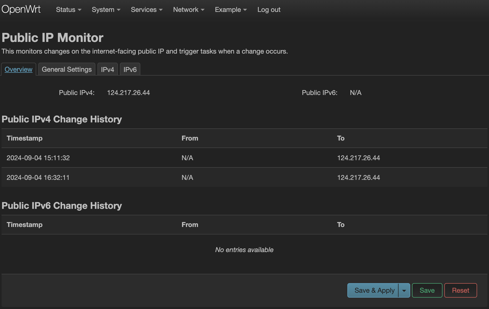
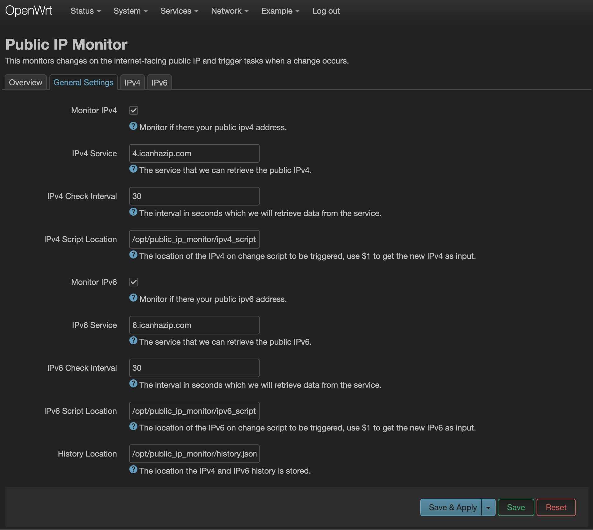
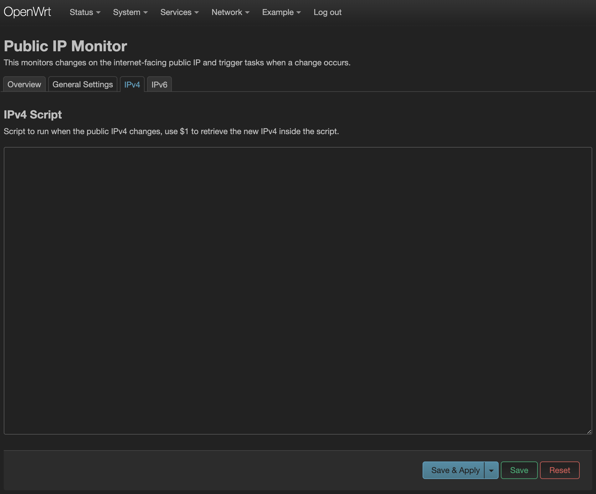

# LuCI App Public IP Monitor

A LuCI application that monitors the internet-facing public IP of the current network.

This app can be used to run a script when a change to the public IP is detected.

Check the [Public IP Monitor Script](https://github.com/calfeche13/public-ip-monitor-script) for the command-line approach.

## Motivation

Public IP Monitor was created to update AWS security group rules, specifically for allowing traffic from my home network. My goal is to maintain a continuous VPN connection between my OpenWrt router and an AWS server without exposing the VPN port to the public. This would enable me to do various things, such as hosting Jellyfin on my personal computer and allowing me and a long-distance loved one to watch movies or series together.

## Want to Support Me?

If you want me to continue making useful apps like this please support me through the links below :)

<a href="https://paypal.me/ChosenAlfeche"
    arget="_blank">
    
</a>

<a href="https://buymeacoffee.com/calfeche"
    target="_blank">
    
</a>

## Setup

To install without building the app simply run the commands below.

```sh
scp -r root/* root@<Openwrt IP>:/
scp -r htdocs/* root@<Openwrt IP>:/www/
```

The above command is useful during development. To actually build an IPK package for installation with opkg, refer to [BUILDING.md](BUILDING.md)

## View
### Location

This is located under the "Services" tab.


### Overview

The overview displays the current IPv4 and IPv6 public addresses and the public ip change history.



### General Settings

The general settings tab is where you configure the app to monitor either IPv4 and IPv6 monitoring.



### On IP Change Scripts

Once an IP, either IPv4 or IPv6, changes, a script can be run for, the tab below allows editing the script via web interface.

