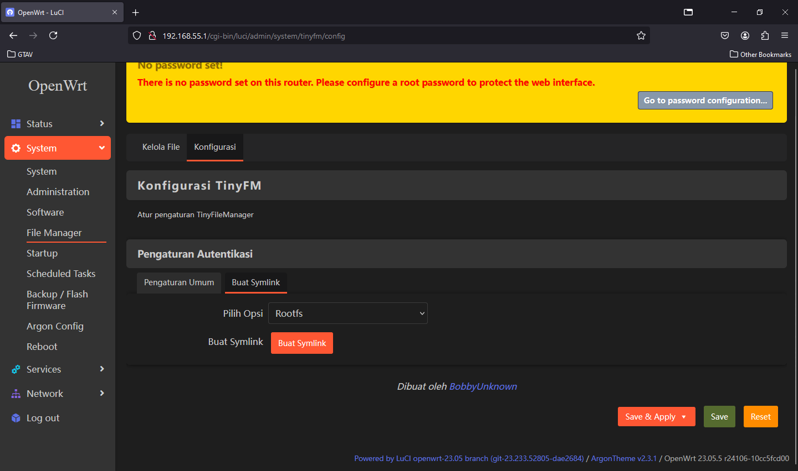
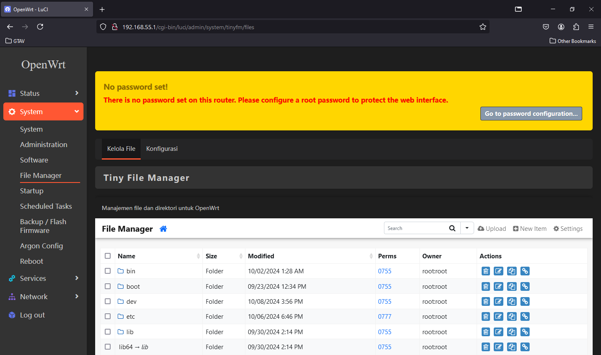
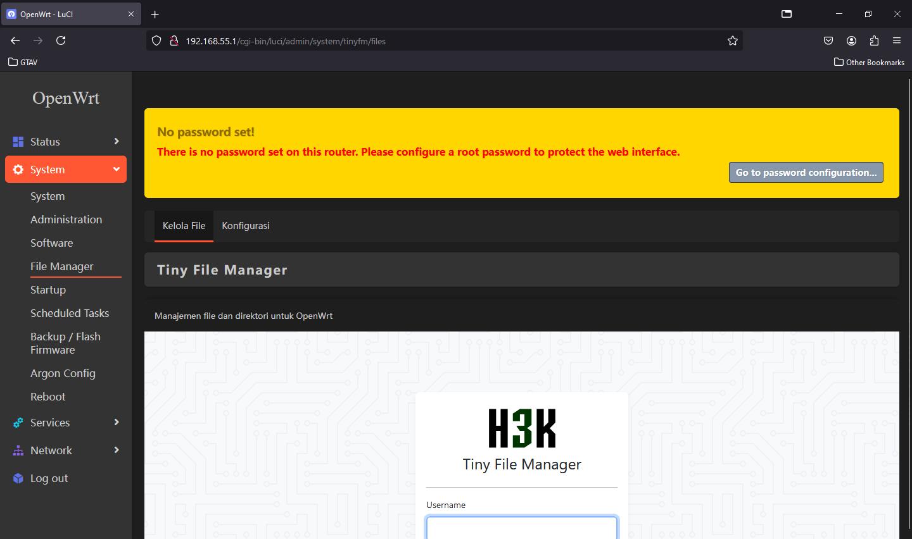
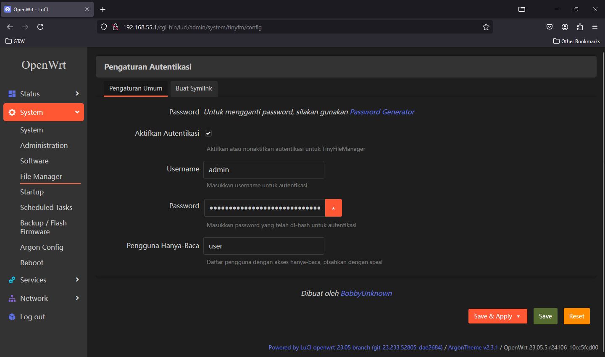

# TinyFM untuk OpenWrt
[](https://github.com/bobbyunknown/luci-app-tinyfm/releases)
[](https://github.com/bobbyunknown/luci-app-tinyfm)

TinyFM adalah aplikasi manajemen file berbasis web yang ringan dan mudah digunakan untuk OpenWrt. Aplikasi ini memungkinkan pengguna untuk mengelola file dan direktori pada router OpenWrt melalui antarmuka web yang intuitif.

### Telegram group:
[](https://t.me/+TuLCASzJrVJmNzM1)

## Fitur Utama

- Antarmuka web yang responsif dan mudah digunakan
- Manajemen file dan folder (buat, hapus, salin, pindah, rename, archive)
- Unggah dan unduh file
- Edit teks file secara langsung di browser
- Tampilan pratinjau untuk gambar dan file teks
- Pengaturan izin file (chmod)
- Kompresi dan ekstraksi file (zip, tar)
- Pencarian file
- Dukungan multi-bahasa

## Instalasi

1. Install dependensi
```
opkg update && opkg install php8 php8-cgi php8-fastcgi php8-fpm php8-mod-session php8-mod-ctype php8-mod-fileinfo php8-mod-zip php8-mod-iconv php8-mod-mbstring coreutils-stat zoneinfo-asia bash curl tar
```

2. Unduh paket ipk terbaru dari [halaman rilis](https://github.com/bobbyunknown/luci-app-tinyfm/releases).
2. Unggah paket ke router OpenWrt Anda.
3. Instal paket menggunakan perintah berikut:
   ```
   opkg install luci-app-tinyfm_xxx.ipk
   ```
4. Akses TinyFM melalui LuCI di `System > File Manager`.

5. Auto install
- curl
```
bash -c "$(curl -fsSL https://raw.githubusercontent.com/bobbyunknown/luci-app-tinyfm/refs/heads/main/install.sh)"
```


## Konfigurasi

Anda dapat mengkonfigurasi TinyFM melalui antarmuka LuCI di `System > File Manager > Configuration`.

Gunakan Symlink untuk rootfs, openclash, mihomo, agar dapat di akses tinyfm, dikonfigurasi melalui antarmuka LuCI di `System > File Manager > Configuration`.

## Keamanan

Pastikan untuk mengubah username dan password default setelah instalasi untuk meningkatkan keamanan.

## Kontribusi

Kontribusi dalam bentuk laporan bug, saran fitur, dan pull request sangat diterima. Silakan buat issue atau pull request di repositori ini.

## Lisensi

TinyFM untuk OpenWrt dilisensikan di bawah Lisensi Open Source Kustom. Lihat file [LICENSE](LICENSE) untuk detailnya.

## Kredit

TinyFM didasarkan pada [Tiny File Manager](https://github.com/prasathmani/tinyfilemanager) oleh Prasath Mani.

Thank to:
 - Allah SWT
 - DBAI
 - IndoWRT
 - Hilman maulana
  [GitHub Action](https://github.com/animegasan/luci-app-speedtest)
## Penafian

Aplikasi ini disediakan "sebagaimana adanya", tanpa jaminan apapun. Gunakan dengan risiko Anda sendiri.


## Screenshot

<details>
<summary>Klik untuk melihat tangkapan layar</summary>






</details>
