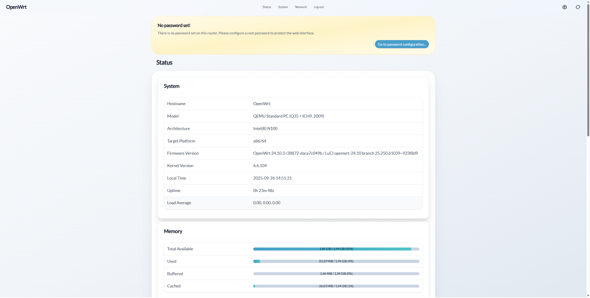
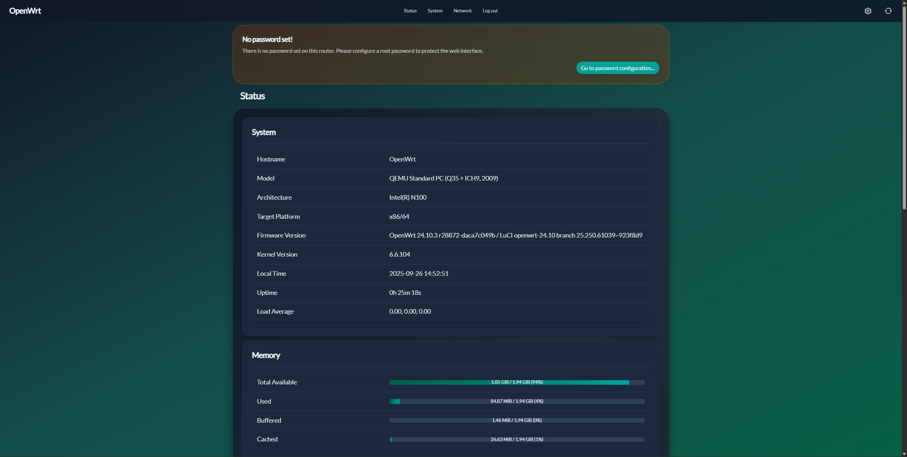
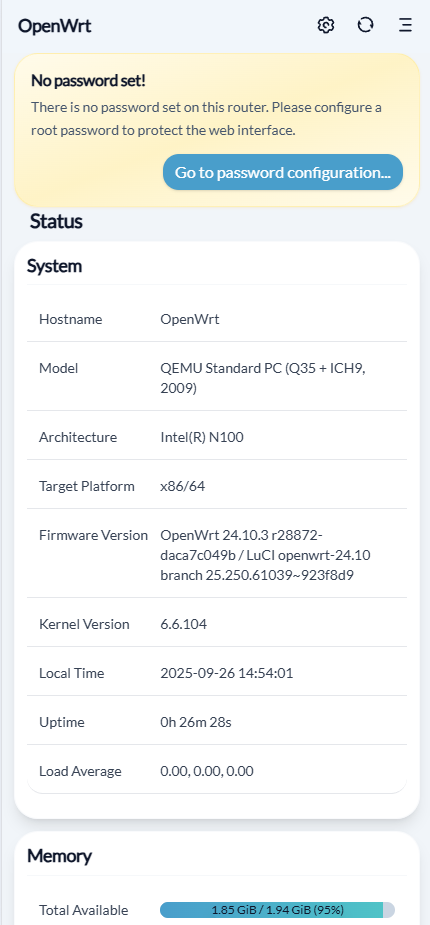

# LuCI Theme Aurora

**English** | [简体中文](README_zh.md)

## Introduction

**luci-theme-aurora** is an OpenWrt theme designed specifically for modern browsers.The design of the theme is inspired by **Aurora** — in Tromsø, northern Norway, the daytime view is of pure white snow-capped mountains, while at night the sky comes alive with dancing auroras.Similarly, in this theme, the light mode reflects the purity of snowy mountains, and the dark mode showcases the enchanting beauty of the aurora.

> ⚠️ **Note**
> The theme is in Beta, and versions are updated frequently. The released version may not always be the latest.
> If you have a build environment, you can compile it yourself; otherwise, you can fork the repository and use the [GitHub Actions workflow](https://github.com/eamonxg/luci-theme-aurora/actions/workflows/build-and-release-aurora.yml) to build the theme automatically.
> Bugs are welcome—please feel free to submit an Issue 🙏💖.

## Compatibility

- **OpenWrt**: The theme uses ucode templates and LuCI JavaScript APIs, requiring OpenWrt 23.05.0 or later.
- **Browsers**: The theme is built with **TailwindCSS v4**, please use the following modern browsers:
  - **Chrome/Edge 111** _(released March 2023)_
  - **Safari 16.4** _(released March 2023)_
  - **Firefox 128** _(released July 2024)_

## Preview

### Desktop

### Mobile

## [About Development](.dev/docs/DEVELOPMENT.md)

As we step into 2025, the development of OpenWrt themes in the market remains fairly primitive, while the frontend toolchain has already become mature and advanced.
Embracing the modern frontend ecosystem is therefore the core philosophy of the Aurora theme.

Aurora uses **Vite** as the build tool.

- During development, you can freely choose and integrate any CSS toolchain.
- In production, multiple strategies are available to optimize bundled assets.
- Most importantly, with the help of a local proxy server, style changes can be previewed in real time!

## License & Credits

The project structure for the production build is based on the official OpenWrt theme
[luci-theme-bootstrap](https://github.com/openwrt/luci/tree/master/themes/luci-theme-bootstrap).

Visual style and some implementations are influenced by
[Apple](https://www.apple.com/) and [Vercel](https://vercel.com/docs/dashboard-features).

The project is developed using a modern front-end stack, including
[Vite](https://vitejs.dev/) and [Tailwind CSS](https://tailwindcss.com/).
